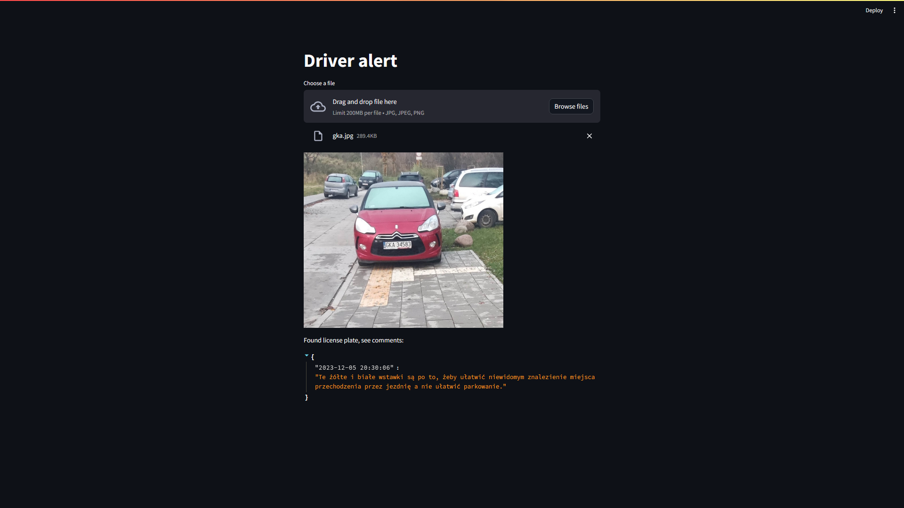

# Diver Alert
Streamlit app that allows to process image with license plate to find information about it online. First trained Faster RCNN to detect license plates, then an image is preprocessed using OpenCV and Text Detection model. The result of preprocessing is passed to Tesseract OCR and then to selenium Scraper.

# Tech stack: 
- OpenCV
- PyTorch
- Streamlit

#### Model checkpoint
https://drive.google.com/drive/folders/1bGCirlsJT__z34ioa9VUC0VN7mydYk4l?usp=sharing
